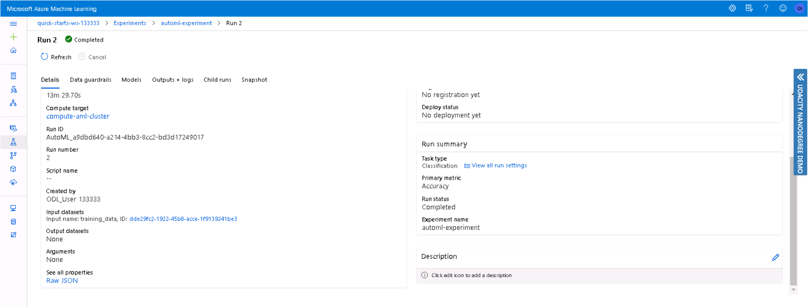
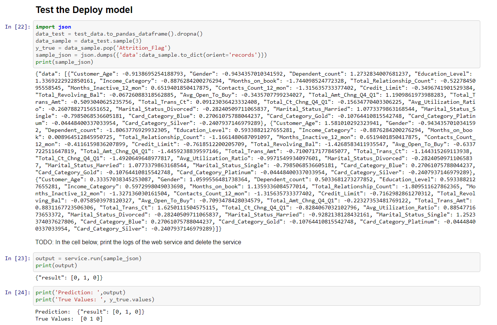

# Train and Deploy Models with Azure ML

## Overview

This project is part of the Udacity Azure ML Nanodegree. In this project, we build and optimize an Azure ML pipeline using the Python SDK and a provided Scikit-learn model. This model is then compared to an Azure AutoML run. The best model is then deployed and tested.

## Dataset

In this project we consider the Credit Card Customer dataset from [kaggle](https://www.kaggle.com/sakshigoyal7/credit-card-customers/notebooks).

A bank manager is uncomfortable with more and more customers leaving their credit card services. They would really appreciate it if someone could predict who will be affected so that they can proactively go to the customer to provide them with better services and turn customer decisions in the opposite direction.

 This data set consists of 10,000 customers mentioning their age, salary, status marital, credit card limit, credit card category, etc.

 The objective is to know the behaviour of the variables and to analyze attributes that indicate a strong relationship with the cancellation of credit card service customers.

__Input Variables:__ age, salary, status marital, credit card limit, credit card category, etc.

**Predict Variable(desired target):**
Attrition_Flag - Has the customer close the account? (binary: “1”, means “Yes”, “0” means “No”)

### Task
In this project, we will build prediction model using Hyperdrive and AutoML that will classify if a customer is going to churn or not.

### Access
Data set was downloaded as a csv and uploaded on the GitHub and then registered it in the workspace. Dataset can be accessed using **Dataset_get_by_name(ws,dataset_name)**


## Approaches

We solved this problem with two different methods -

1. Optimize the hyperparameter of custom-coded standard Scikit-learn Random Forest model using HyperDrive.
1. Find the Optimal Model for the same dataset using Automated Machine Learning.

## Hyperparameter Tuning

Steps performed in train.py are:

* Import all the dependencies
* Set up workspace and initialize an experiment
* Load registered dataset from workspace using **Dataset_get_by_name(ws,dataset_name)**
* Clean data using clean_data function, which involves -
    * Converting categorical variable to binary using one-hot encoding.
    * Dropping missing values etc.
* Split the dataset using the “train_test_split” function in Scikit-learn into train and test in the ratio 80% and 20% respectively.
* Use the Scikit-learn model to fit the training data.
* Compute accuracy for train data using Scikit learn model.
* Save the model in the folder outputs/model.joblib

In this project, we used Random Forest, that belongs to the supervised learning technique. It can be used for both Classification and Regression problems in ML. It is based on the concept of ensemble learning, which is a process of combining multiple classifiers to solve a complex problem and to improve the performance of the model.

Four types of hyperparameters used are-
1. n_estimators: Defines the number of trees you want to build before taking the maximum voting or averages of predictions.
1. max_depth: Defines the longest path between the root node and the leaf node.
1. min_samples_split: Defines the minimum required number of observations in any given node in order to split it.
1. min_samples_leaf: Defines the minimum number of samples that should be present in the leaf node after splitting a node.

We need to tune these hyperparameters, manual hyperparameter tuning is extremely time-consuming so we are using HyperDrive to find optimal hyperparameter for the random forest model.

Tuning hyperparameter is done in the jupyter notebook *hyperparameter_tuning.ipynb*.

Steps performed in the hyperparameter_tuning.ipynb for hyperparameter tuning are:
* Define search space: Dictionary is created with the set of hyperparameter values i.e n_estimators, max_depth, min_samples_split and min_samples_leaf.
```
    param_space = {
        '--n_estimators': choice(2, 4, 8, 16, 32, 64, 200),
        '--max_depth': choice(5, 8, 15, 25, 30),
        '--min_samples_split': choice(2, 5, 10, 15, 100),
        '--min_samples_leaf': choice(1, 2, 5, 10)
        }
```
* Configuring sampling: Specific values used in a hyperparameter tuning run depend on the sampling used. We have used *RandomParameterSampling*.

    Advantages of Random Parameter Sampling:

    1. Random sampling is used to randomly select value so, it eliminates sampling bias.
    2. It supports discrete and continuous hyperparameters.
    3. It reduces computation time.
```
    ps = RandomParameterSampling(param_space)
```


* Early termination policy: To help prevent wasting time, you can set an early termination policy that abandons runs that are unlikely to produce a better result than previously completed runs.<br>
Bandit policy stops a run if the target performance metric underperforms the best run so far by a specified margin. It is based on slack criteria and a frequency and delay interval for evaluation.
Any run that doesn't fall within the slack factor or slack amount of the evaluation metric with respect to the best performing run will be terminated.

* Use ScriptRunConfig:
Represents configuration information for submitting a training run in Azure Machine Learning.
<br>A ScriptRunConfig packages together the configuration information needed to submit a run in Azure ML, including the script, compute target, environment, and any distributed job-specific configs.The environment is setup for the run.
```
    sklearn_env = Environment.from_conda_specification(name='sklearn-env', file_path='conda_dependencies.yml')

    src = ScriptRunConfig(source_directory='.',
                        entry_script='train.py',
                        compute_target=compute_aml_cluster
                        environment=sklearn_env
                        )
```
* Configure hyperdrive experiment:
To prepare the hyperdrive experiment, you must use a HyperDriveConfig object to configure the experiment run.<br>
HyperDriveConfig is created using the estimator, hyperparameter sampler, and early termination policy.
```

    hyperdrive_config =HyperDriveConfig(estimator=estimator,
                                hyperparameter_sampling=ps,
                                policy=policy,
                                primary_metric_name='Accuracy',
                                primary_metric_goal=   
                                PrimaryMetricGoal.MAXIMIZE,
                                max_total_runs=12,
                                max_concurrent_runs=4,
                                run_config=src
                                )
```
<br>
    primary primary_metric_name: The name of the primary metric reported by the experiment runs.

    primary_metric_goal: Either PrimaryMetricGoal.MINIMIZE or PrimaryMetricGoal.MAXIMIZE. This parameter determines if the
    primary metric is to be minimized or maximized when evaluating runs.

    max_total_runs and max_concurrent_runsThe maximum total number of runs to create.The maximum number of runs to execute concurrently.

* Submit experiment:
Submit your hyperdrive run to the experiment and show run details with the widget.
```
    hyperdrive_run = exp.submit(config=hyperdrive_config)
```
  * Run completed


  * Run details in workspace


  * Run details in notebook


* Get the best run and metric
```
    best_run = hyperdrive_run.get_best_run_by_primary_metric()
    best_run_metrics=best_run.get_metrics()
```

### Results
The best model of HyperDrive run is with 0.95261 accuracy.


## Automated ML
*Automated Machine Learning (AutoML)* enables you to try multiple algorithms and preprocessing transformations with your data. This, combined with scalable cloud-based computing makes it possible to find the best performing model for your data without the huge amount of time-consuming manual trial and error that would otherwise be required.

AutoML is done in the jupyter notebook *automl.ipynb*.

Steps performed in the automl.ipynb for AutoML are:

* Import all the dependencies
* Set up workspace and initialize an experiment
* Load registered dataset from workspace using **Dataset_get_by_name(ws,dataset_name)**
* Prepare data: We have defined *pre_processing* function which returns features and targets as DataFrame and Series, respectively.
* Concatenated data returned from pre_processing function in Dataframe, all_data.
* Split the data into train and test sets in the ratio 80% and 20% respectively.
* Save the training data and testing data in the folder training/train_data.csv or training/test_data.csv respectively.
* Get the datastore and upload train_data.csv and test_data.csv to the datastore and create datastore referencing.
```
    datastore = ws.get_default_datastore()
    datastore.upload(src_dir='training/', target_path='data/')
    train_data = TabularDatasetFactory.from_delimited_files(path = [(datastore, ('data/train_data.csv'))])
    test_data = TabularDatasetFactory.from_delimited_files(path = [(datastore, ('data/test_data.csv'))])
```
* Configure *AutoMLConfig* class:
It represents the configuration for submitting an autoML experiment and contains various parameters.
```
    automl_settings = {
    "experiment_timeout_minutes": 30,
    "max_concurrent_iterations": 10,
    "primary_metric" : 'accuracy',
    "n_cross_validations": 3,
    "max_cores_per_iteration":-1
    }

    automl_config = AutoMLConfig(
      compute_target=compute_aml_cluster,
      task = "classification",
      training_data=train_data,
      label_column_name="Attrition_Flag",   
      path = project_folder,
      enable_early_stopping= True,
      debug_log = "automl_errors.log",
      **automl_settings
```
<br>

    *experiment_timeout_minutes:* Time limit in minutes for the experiment.

    *primary_metric:* Metric that you want to optimize. The best-fit model will be chosen based on this metric.

    *label_column_name:* The name of the label column whose value your model will predict.

    *n_cross_validations:* Number of cross-validation splits to perform when validation data is not specified.

    *max_cores_per_iteration:* The maximum number of threads to use for a given training iteration.-1, which means to use all the possible cores per iteration per child-run.

    *max_concurrent_iterations:* Represents the maximum number of iterations that would be executed in parallel.

* Submit AutoML experiment and show results with the RunDetails.
```
    remote_run = experiment.submit(automl_config, show_output=True)
    RunDetails(remote_run).show()
    remote_run.wait_for_completion(show_output=True)
```
  * Run in workspace
    * Completed run



    * Models used by AutoML


  * Run in notebook

  
* Get the best run and metric
```
    best_run, fitted_automl_best_model = remote_run.get_output()
    best_run_metrics = best_run.get_metrics()
```
* Run in workspace
  * Best run
   
  * Best run with Metrics


* Run in notebook
  * Best run

  * Best run with Metrics

  


Different types of algorithms used for classification in Azure ML are:


### Results

The best of the automated ML run is voting ensemble with 0.97257 accuracy.

   

### Summary Results:

* HyperDrive &ensp;: 0.95261
* AutoML &ensp;&ensp;&ensp;&ensp;: 0.97257 (best model: VotingEnsemble)

## Model Deployment
Automate ML model gives better result so we deployed best run of AutoML.

* Provide a scoring script that will be invoked by the web service call (using scoring.py).The scoring script must have two required functions, init() and run(input_data).

  * init(): Loading your model
  * run():Running your model on input data

* Provide an environment file so that Azure Machine Learning can install the necessary packages in the Docker image which are required by your scoring script.

* Create InferenceConfig:
<br>An inference configuration describes how to set up the web-service containing your model. It's used later, when you deploy the model.
<br>Best run environment and score.py file is provided to the InferenceConfig. cpu_cores and memory_gb are initialized as 1 for the deployment configuration and deploy to Azure Container Instance(ACI).

```
    inference_config = InferenceConfig(entry_script=script_file, environment=env)

    deployment_config = AciWebservice.deploy_configuration(cpu_cores = 1,
                                                           memory_gb = 1)

    deploy_service_name= 'automl-model-deployment'
    service = Model.deploy(ws,deploy_service_name,  [model], inference_config, deployment_config)

    service.wait_for_deployment(show_output = True)

    scoring_uri = service.scoring_uri
```

&nbsp;&nbsp;&nbsp;&nbsp;Successful model deployment.


&nbsp;&nbsp;&nbsp;&nbsp;After successful deployment we can get scoring scoring uri.

```
    print(scoring_uri)
```


&nbsp;&nbsp;&nbsp;&nbsp;Model deployment overivew


&nbsp;&nbsp;&nbsp;&nbsp;Model endpoint


* We can test the deployed model endpoint. We pick the first 3 samples from the test dataset, and send it to the web service hosted in ACI and see the actual and predicated values.


## Screen Recording
[Screencast]()

## Standout Suggestions
* For hyperdrive,
  * Try a different combination of values for hyperparameter tuning.
  * Instead of using random sampling you can also grid sampling.


* For AutoML,
<br>Accuracy is affected due to imbalanced classes in the input, because the input data is biased towards certain classes.<br>
Some of the ways you can handle imbalanced data:

  * Change performance matrix: Accuracy is not the metric to use when working with an imbalanced dataset because it is misleading. Metrics that can provide better insight include:
      * AUC_weighted
      * Confusion Matrix
      * Precision
      * Recall
      * F1 Score
  * Use a weight column: automated ML supports a column of weights as input, causing rows in the data to be weighted up or down, which can be used to make a class more or less "important".
